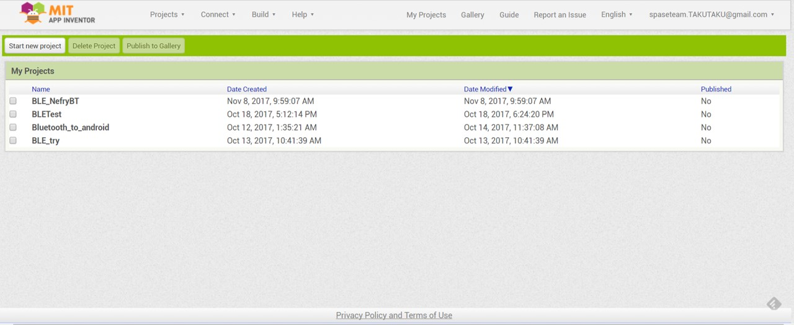
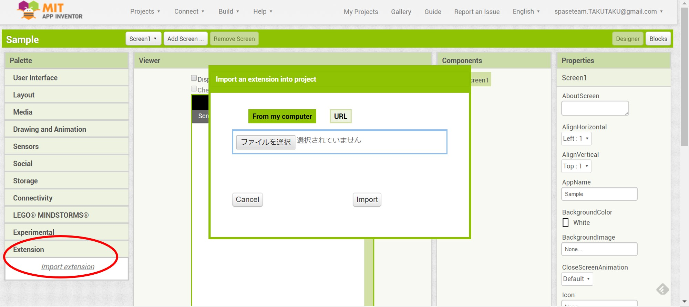
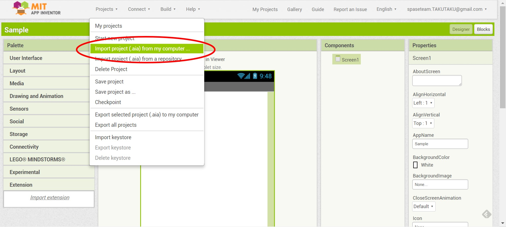
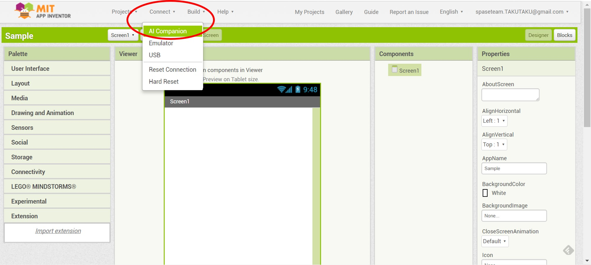
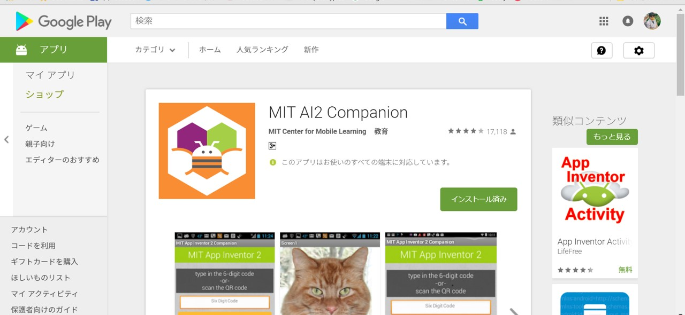

# MIT App Inventorについて
### 1．MIT App Inventorにアクセス  
　http://appinventor.mit.edu/explore/  
 そして，Creat apps!をクリック．  
  

### 2.BLE機能を追加  
MIT App InventorでBLE機能を使うにはライブラリをいれる必要があります．  
フォルダ内にある「edu.mit.appinventor.ble.aix」を下記の手順でいれてください．   
まず，「start new project」で新規プロジェクトを作成してください．  
  
左にある「Extension」をクリックし先ほどのaixファイルをimportしてください．
  
これでBLE機能が使えるようになるはずです．  

### 3．プログラムをimport
下記の画像のように，BLE_NefryBT.aiaをimportしてください．
 

### 4．プログラムの動作確認
上部にあるconnectをクリックします．  
次に「Al companion」をクリック.QRコードと文字列が出てきます．  
これをアプリ側でQRコードを読み込むか文字列を入力します．  
アプリについて下記に示します．

いくつか方法があります．  
・スマーフォンにある対応アプリから(今回はこれを使います)  
・USB  
・エミュレータ  

◎Androidのスマートフォンに「MIT AI2 Companion」というアプリを導入

